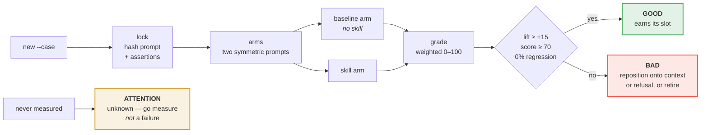
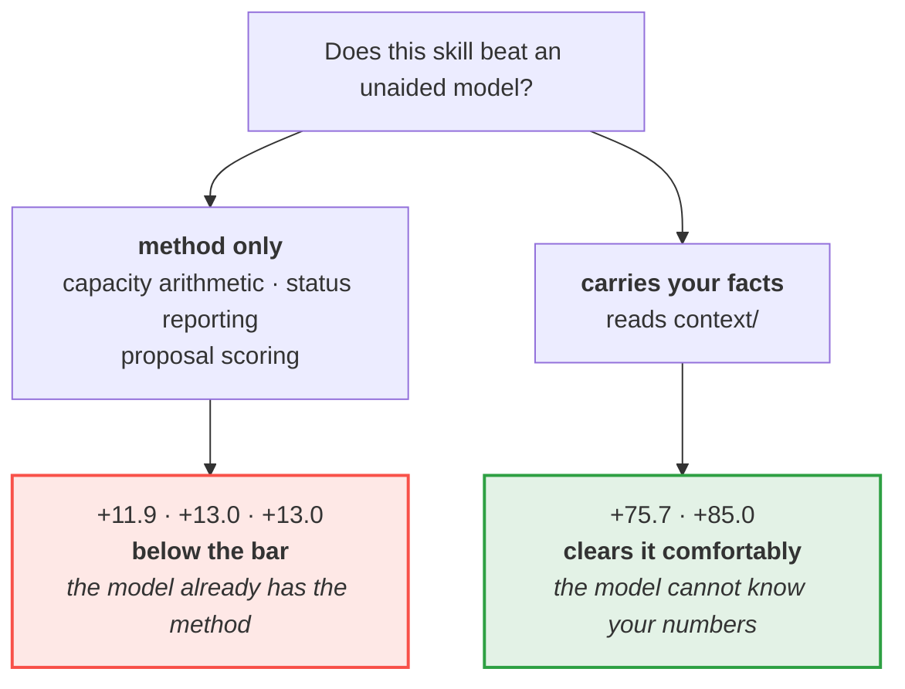

# Agent Skills

A library of reusable, portable skills for working with AI coding agents (Claude Code and similar tools) — patterns for API design, platform engineering, delivery workflow, governance, and compliance-aware development that I use across projects and am sharing as part of my work in applied AI / agentic engineering.

Each file is a self-contained "skill": an objective, the inputs an agent needs, the expected output shape, and a concrete instruction block an agent can run — not just a description of a practice, but something directly usable.

## Why this exists

Most of what makes AI coding agents genuinely useful in a real engineering org isn't the model — it's the surrounding scaffolding: how you package domain knowledge so it's loaded only when relevant, how you keep configuration files lean enough that an agent actually follows them, how you turn a compliance requirement into something an agent can check itself against instead of something a human has to remember. This repo is where I collect and refine that scaffolding.

## What this is for

A product manager's ordinary week: sizing a sprint against real capacity, refining a vague
epic into something estimable, scoring the proposal that arrived by executive escalation,
writing the status report people can act on, deciding what to say no to and being able to
defend it. The **Daily Kit** installs as auto-triggering skills, so they
fire from the work rather than needing to be remembered.

**The method alone is not the value, and we measured that.** Across six pre-registered
with/without comparisons, skills that supply only method beat an unaided model by +11.9 to
+13.0 — below the bar we set. Skills that carry the organisation's own facts beat it by
**+75.7** and **+85.0**. A modern model already knows product method and already knows your
industry; what it cannot know is your instantiation of either.

**Which is why this works outside fintech.** The kit is domain-neutral; the fintech content is
confined to `skills/domains/` (and, in the private working repo, `skills/practitioner/`). The +85.0 result above came from a
clinical-trials proposal with **no** clinical-trials skill in the library — only a context file
describing one company's buyer, regulatory posture, release freezes, account concentration,
measured estimation multipliers, and what it had already tried and abandoned. The unaided
control wrote an expert answer about the industry and a naive one about the company.

See [`CONTEXT.md`](CONTEXT.md) for how to write those files, the full evidence table, and the
limits — including the one this design does not yet solve, which is detecting a context file
that has gone stale.

## How it fits together

```mermaid
flowchart LR
    subgraph LIB["skills/ — 134 skills, 14 categories"]
        direction TB
        M["<b>method</b><br/>delivery · refinement<br/>communication · strategy<br/>management"]
        G["<b>governance</b><br/>PCI · privacy<br/>regional auth mandates"]
        D["<b>domain</b><br/>domains/<br/><i>currently fintech</i>"]
    end

    subgraph KIT["kit/ — 18 installable<br/><i>working repo</i>"]
        direction TB
        OP["<b>one-pager</b><br/>symlink to the skill<br/>≤ 900 words"]
        RC["<b>run card</b><br/>one screen, template-first<br/>+ reference.md symlink"]
    end

    subgraph CTX["context/ — <b>your</b> facts"]
        direction TB
        TM["team.md<br/>velocity · leave<br/>measured load"]
        DM["domains/*.md<br/>real buyer · regulatory posture<br/>freezes · multipliers<br/>what you already abandoned"]
    end

    CL["~/.claude/skills<br/><b>auto-trigger</b> on description"]
    WORK["the PM's actual work<br/>sprint · epic · proposal · status"]
    ROUTER["skill-selection-router"]

    LIB -->|promote what earns it| KIT
    KIT -->|"skills_wiring.py install"| CL
    CL --> WORK
    CTX ==>|read at runtime| WORK
    WORK -.-> ROUTER
    ROUTER -.->|looks up the ~140<br/>never installed| LIB

    classDef ctx fill:#1f6feb22,stroke:#1f6feb,stroke-width:2px
    class CTX,TM,DM ctx
```



**The thick edge is the one that matters.** Everything else is plumbing; `context/` is where
the measured benefit comes from.

### The evidence gate

No skill reaches `kit/` on assertion. It has to beat an unaided model on a pre-registered case:



`lock` makes the prompt and assertions tamper-evident; `grade` voids itself if they changed
after the arms ran. At least 40% of assertion weight must be written independently of the
skill, because assertions taken from a skill's own claims are passed by construction.

### What the measurements said



The +85.0 came from a **clinical-trials** proposal with no clinical-trials skill in the
library — only a context file describing one company. The failures and one withdrawn verdict
are recorded alongside the passes; the per-case records are kept in the private working repository, because the test material is real internal project data — the method and the harness that produced them are published here.

> **What is in this repository and what is not.** The diagrams describe the whole system. This public repository carries the skills, [`CONTEXT.md`](CONTEXT.md), and both tools in [`tools/`](tools/). The installable `kit/` run cards and the `evals/` case records are kept in the private working repository.

## Layout

```
skills/
├── orchestration/                # multi-agent task mechanics: decomposition, handoff contracts,
│                                  # conflict resolution, failure/circuit-breaking, harness selection, memory
├── journeys/                     # end-to-end, per-product customer-lifecycle specification
│                                  # + the orchestration/durability/tracing backbone that enforces it
├── engineering/                  # UI/frontend design, testing strategy, code review, coding standards —
│                                  # human-driven skills each paired with an agent-driven companion
├── domains/                      # payments, pricing, compliance, security
├── platform/                     # engineering/runtime: monorepo, tooling, testing, infra
├── product/                      # product overlays shared across a product family
├── strategy/                     # product-leadership strategy: portfolio, investment cases, annual goals
├── refinement/                   # pre-delivery workstream prioritization and plan-realism checks
├── management/                   # management practice grounded in W. Edwards Deming's work
├── delivery/                     # planning, decomposition, QA, release, workflow execution
├── governance/                   # standards, controls, monitoring, policy
├── financial-impact-analysis/    # cost modeling, margin governance, pricing-floor discipline
├── templates/                    # canonical authoring templates for new skills/recipes
├── recipes/                      # reusable procedure-style instructions
└── communication/                # structuring written reports, memos, RFCs, briefings
```

Start at [`skills/INDEX.md`](skills/INDEX.md).

## A few to look at first

- [`skills/orchestration/`](skills/orchestration/) — the core of the applied-agentic-engineering work in this repo: how a coordinator agent splits a goal into bounded subtasks ([`task-decomposition-and-routing.md`](skills/orchestration/task-decomposition-and-routing.md), grounded in Anthropic's own published multi-agent research system), hands work between agents with a concrete, trackable schema ([`inter-agent-handoff-contract.md`](skills/orchestration/inter-agent-handoff-contract.md), grounded in Google's Agent2Agent/A2A protocol), tells real consensus apart from same-context agents just agreeing with themselves ([`conflict-and-consensus-resolution.md`](skills/orchestration/conflict-and-consensus-resolution.md)), contains a failing step before it cascades ([`agent-chain-failure-and-escalation.md`](skills/orchestration/agent-chain-failure-and-escalation.md), a Closed/Open/Half-Open circuit breaker adapted from the Azure Architecture Center's own pattern), and gives an agent persistent, encrypted-at-rest, source-attributed memory across sessions ([`agent-memory-architecture-and-consolidation.md`](skills/orchestration/agent-memory-architecture-and-consolidation.md), grounded in MemGPT's tiered-memory research).
- [`skills/platform/api-builder.md`](skills/platform/api-builder.md) — orchestrates seven sub-recipes to design/extend REST API contracts against both the [OpenAPI Specification](https://swagger.io/specification/) and [Google's API design guide](https://docs.cloud.google.com/apis/design), sequencing resource-shape decisions before contract-syntax mechanics.
- [`skills/platform/llm-model-contract.md`](skills/platform/llm-model-contract.md) — an offline-first LLM provider abstraction pattern: apps request a capability tier, never a hard-coded model name, and degrade gracefully with no network access.
- [`skills/engineering/agent-driven-code-review-calibration.md`](skills/engineering/agent-driven-code-review-calibration.md) — names the specific failure mode where an AI reviewer reports plausible-looking findings regardless of whether the code actually has problems, and requires every finding traced to a diff line and a concrete failure scenario before it's trusted.
- [`skills/recipes/payment-processing-recipe.md`](skills/recipes/payment-processing-recipe.md) + [`skills/governance/pci-dss-req-3-4.md`](skills/governance/pci-dss-req-3-4.md) — a worked example of tracing a specific compliance requirement (PCI-DSS Req 3.4, now numbered 3.5 under v4.0.1) into a mandatory, agent-checkable implementation recipe.
- [`skills/product/systems-thinking-and-domain-driven-design.md`](skills/product/systems-thinking-and-domain-driven-design.md) — the foundational lens for product decisions: the Iceberg model and Meadows' leverage-points hierarchy for diagnosing a problem, then DDD's ubiquitous language and Bounded Context Canvas for carrying that decision into a technical solution.
- [`skills/management/`](skills/management/) — six skills grounded in W. Edwards Deming's work: the System of Profound Knowledge, the Fourteen Points, the Seven Deadly Diseases, PDSA, and the Red Bead / Funnel experiments for telling system-caused variation apart from real signal before rating people or reacting to a single data point.

## Finding a skill (semantic search)

Browsing `skills/INDEX.md` works, but for a fuzzy "which skill covers X" question there's a small, dependency-free search tool over the whole library:

```bash
ollama pull nomic-embed-text        # one-time, ~270MB, local
python tools/skills_index.py search skills-index.json "how do I design a webhook payload"
```

`skills-index.json` is checked in (prebuilt, regenerated whenever skills change) — the `search` command only needs a local Ollama running to embed your query, no other setup. Re-run `python tools/skills_index.py build skills/ --out skills-index.json` after adding or editing a skill. See the tool's own docstring for the offline-first defaults and how to point it at a different endpoint/model.

## Using a skill

Each skill file follows one of a few consistent formats (see [`skills/templates/`](skills/templates/)) — a `Core Prompt / Instructions` block meant to be handed to an agent more or less as-is, plus inputs, expected output, and a quality checklist for verifying the result. Point your agent at the relevant file, or fold it into project-level agent configuration (e.g. a `CLAUDE.md`) so it's loaded automatically.

## Notes

Some skills are placeholders as they are being worked on. Please check back often for updates. See [`RELEASE_NOTES.md`](RELEASE_NOTES.md) for the current available-vs-in-progress breakdown.

## Credits

Specifications, standards, and people whose work informed these skills are tracked in [`CREDITS.md`](CREDITS.md), linked from the specific files that cite them.

## License

MIT — see [`LICENSE`](LICENSE). Use, adapt, and redistribute freely.
