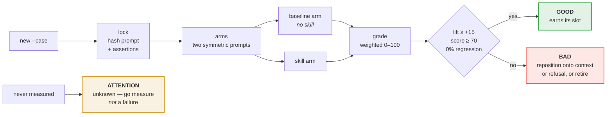
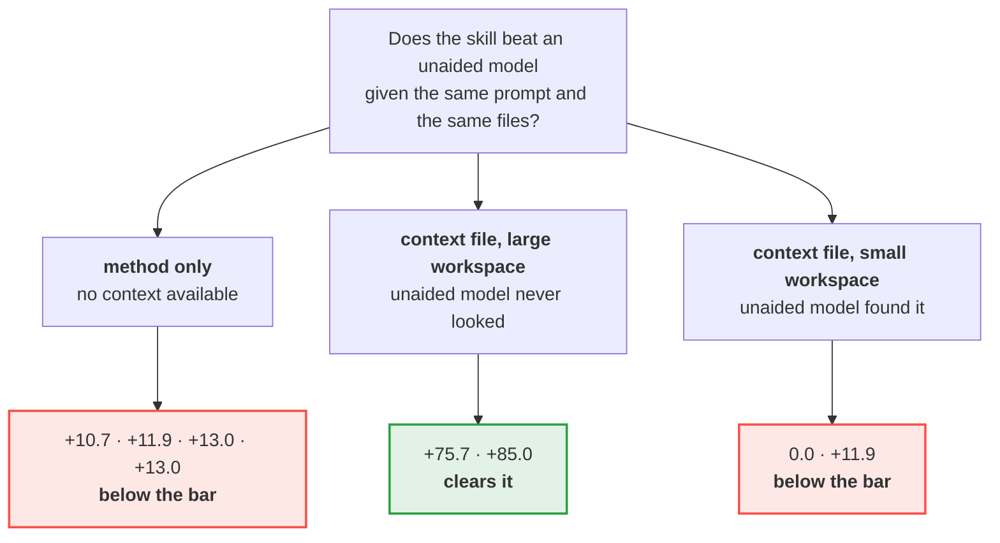

# Agent Skills

A library of reusable, portable skills for working with AI coding agents (Claude Code and similar tools) — patterns for API design, platform engineering, delivery workflow, governance, and compliance-aware development that I use across projects and am sharing as part of my work in applied AI / agentic engineering.

Each file is a self-contained "skill": an objective, the inputs an agent needs, the expected output shape, and a concrete instruction block an agent can run — not just a description of a practice, but something directly usable.

## Why this exists

Most of what makes AI coding agents genuinely useful in a real engineering org isn't the model — it's the surrounding scaffolding: how you package domain knowledge so it's loaded only when relevant, how you keep configuration files lean enough that an agent actually follows them, how you turn a compliance requirement into something an agent can check itself against instead of something a human has to remember. This repo is where I collect and refine that scaffolding.

## What this is for

A product manager's ordinary week: sizing a sprint against real capacity, refining a vague
epic into something estimable, scoring the proposal that arrived by executive escalation,
writing the status report people can act on, deciding what to say no to and being able to
defend it. The **Daily Kit** installs as auto-triggering skills, so they
fire from the work rather than needing to be remembered.

**What we measured — including where we were wrong.** Eight pre-registered with/without
comparisons, graded against an unaided model given the same prompt and the same file access.
Three findings survive:

1. **Method alone does not clear the bar.** Four method-only cases landed between +10.7 and
   +13.0. A modern model already knows product method, and already knows your industry.
2. **A context file changes the answer more than any skill does.** On a byte-identical sprint
   prompt, adding a one-page `context/team.md` moved the recommended commitment from 21–25
   points to about 15 — for the unaided model *and* the skill alike. It needed no skill.
3. **What a skill reliably adds is refusal.** Declining to scope an unevidenced build, where a
   helpful model scopes one anyway. In the two cases where it was the only difference, it was
   worth exactly +11.9 both times.

Our first context runs scored **+75.7** and **+85.0** — in a large multi-project workspace where
the unaided model never went looking for the file. Reproduced in small synthetic workspaces
holding only the context file, the unaided model found it itself and the gap fell to **0.0** and
**+11.9**. So the honest claim is narrower than the one we first published: *a skill makes sure
your context gets read when it is not the obvious thing to look at.*

**This is not fintech-bound.** The kit is domain-neutral; fintech content is confined to
`skills/domains/` (and, in the private working repo, `skills/practitioner/`). Clinical-trials and K-12 education cases — no skill
in the library for either — behaved exactly like the payments cases: the model supplied the
industry, and a context file supplied the company.

See [`CONTEXT.md`](CONTEXT.md) for how to write those files, the full evidence table, and the
limits — including the one this design does not yet solve, which is detecting a context file
that has gone stale.

## How it fits together

```mermaid
flowchart LR
    subgraph LIB["skills/ — 134 skills, 14 categories"]
        direction TB
        M["<b>method</b><br/>delivery · refinement<br/>communication · strategy<br/>management"]
        G["<b>governance</b><br/>PCI · privacy<br/>regional auth mandates"]
        D["<b>domain</b><br/>domains/<br/><i>currently fintech</i>"]
    end

    subgraph KIT["kit/ — 18 installable<br/><i>working repo</i>"]
        direction TB
        OP["<b>one-pager</b><br/>symlink to the skill<br/>≤ 900 words"]
        RC["<b>run card</b><br/>one screen, template-first<br/>+ reference.md symlink"]
    end

    subgraph CTX["context/ — <b>your</b> facts"]
        direction TB
        TM["team.md<br/>velocity · leave<br/>measured load"]
        DM["domains/*.md<br/>real buyer · regulatory posture<br/>freezes · multipliers<br/>what you already abandoned"]
    end

    CL["~/.claude/skills<br/><b>auto-trigger</b> on description"]
    WORK["the PM's actual work<br/>sprint · epic · proposal · status"]
    ROUTER["skill-selection-router"]

    LIB -->|promote what earns it| KIT
    KIT -->|"skills_wiring.py install"| CL
    CL --> WORK
    CTX ==>|read at runtime| WORK
    WORK -.-> ROUTER
    ROUTER -.->|looks up the ~140<br/>never installed| LIB

    classDef ctx fill:#1f6feb22,stroke:#1f6feb,stroke-width:2px
    class CTX,TM,DM ctx
```



**The thick edge is the one that matters.** On an identical prompt, adding a context file moved
a sprint commitment by 30–40% — for an unaided model and a skill alike. Everything else is
plumbing.

### The evidence gate

No skill reaches `kit/` on assertion. It has to beat an unaided model on a pre-registered case:



`lock` makes the prompt and assertions tamper-evident; `grade` voids itself if they changed
after the arms ran. At least 40% of assertion weight must be written independently of the
skill, because assertions taken from a skill's own claims are passed by construction.

### What the measurements said



Read together: **the context file is what fixes the answer; the skill's job is making sure it
gets read.** Where the file was easy to find, an unaided model read it without help. The +11.9
that recurs is refusal — the one thing a skill added every time. In this repository the three `synthetic` cases are published in [`evals/`](evals/), with the fictional workspaces they use in [`examples/`](examples/). The other cases were built on internal project data and are kept in the private working repository. Re-run the synthetic cases, or
re-score them under your own thresholds with `--profile`.

> **What is in this repository and what is not.** The diagrams describe the whole system. Published here: the skills, [`CONTEXT.md`](CONTEXT.md), both tools in [`tools/`](tools/), the scoring policy [`evals/eval-config.toml`](evals/eval-config.toml), three synthetic eval cases, and the fictional workspaces in [`examples/`](examples/). The installable `kit/` run cards and the internal eval cases are kept in the private working repository.

## Evaluating skills yourself

**A kit skill should be installed on evidence, not assertion.** `tools/skill_eval.py` runs a
with-skill vs without-skill comparison and enforces the three things that went wrong the
first two times this library tried it:

```bash
tools/skill_eval.py new <skill>     # scaffold evals/<skill>.md
tools/skill_eval.py lock <skill>    # hash the prompt + assertions (tamper-evident)
tools/skill_eval.py arms <skill>    # print two symmetric prompts to dispatch as subagents
tools/skill_eval.py grade <skill>   # verify the hash, score against the bar
tools/skill_eval.py status          # which kit skills have a passing eval
```

- **Symmetry.** Both arms come from one template and differ only in the skill file. Running
  one arm yourself and the other as a subagent measures the runner, not the skill — that
  mistake produced a headline finding that had to be withdrawn.
- **Trap condition.** A case must declare what has to be present in the prompt for the
  claimed edge to be testable. A rule against double-counting cannot be tested on a prompt
  with nothing to double-count.
- **Pre-registration.** The prompt, trap condition and assertions are hashed at `lock`;
  `grade` voids itself if they changed. Assertions written after seeing output grade
  themselves.

**Evidence and policy are kept apart.** A case file is *evidence*: a locked prompt, locked
assertions, and whether each arm passed each one. [`evals/eval-config.toml`](evals/eval-config.toml)
is *policy*: what each kind of assertion is worth and what counts as good enough. Change the
policy and `status` re-scores every case from its locked results — nothing is re-run, and no
verdict written under an old policy survives unexamined.

| kind | default weight | what it tests |
|---|---|---|
| `refusal` | 25 | declines or withholds where a helpful model would proceed |
| `decision` | 25 | a different number, sequence or conclusion |
| `context` | 20 | uses an injected fact the model cannot know |
| `convention` | 15 | applies a house rule the model cannot guess |
| `format` | 5 | presentation only — deliberately cheap |

Three thresholds decide a pass — **lift** (skill score minus baseline score, both 0-100), the
skill's own **minimum score**, and **maximum regression** (weight lost on assertions the
baseline passed). They come in named profiles you can switch per run:

```bash
tools/skill_eval.py policy                     # what is in force, and every profile
tools/skill_eval.py status --profile strict    # lift ≥ +25, skill ≥ 80, 0% regression
tools/skill_eval.py status --profile exploratory
```

Add your own profile in the config. The one rule worth keeping: **choose the policy before
you look at a result.** A threshold moved to rescue a failure stops meaning anything.

**Two guards are about how a case is built, not how it is scored**, and `lock` enforces both.
A case whose non-format weight cannot reach the lift threshold is refused, so no skill passes
on formatting. And at least 40% of weight must have `origin: independent` — written from what
a good answer to the *prompt* contains, without reference to the skill. The first cases run
here were built from the skill's own claims; the skill passed them by construction, scored
exactly 100.0 every time, and `lift` quietly became `100 - baseline`.

**Workspaces.** A case may set `workspace:` to a directory both arms may read — and nothing
outside it, so neither can read the case file and see the assertions. That is how context
files are tested fairly: same access for both arms, and neither is told the file exists.

A skill that fails is repositioned onto an axis it can win — a convention only you know, an
injected fact, or a refusal an unaided model will not make — or retired.

## Layout

```
skills/
├── orchestration/                # multi-agent task mechanics: decomposition, handoff contracts,
│                                  # conflict resolution, failure/circuit-breaking, harness selection, memory
├── journeys/                     # end-to-end, per-product customer-lifecycle specification
│                                  # + the orchestration/durability/tracing backbone that enforces it
├── engineering/                  # UI/frontend design, testing strategy, code review, coding standards —
│                                  # human-driven skills each paired with an agent-driven companion
├── domains/                      # payments, pricing, compliance, security
├── platform/                     # engineering/runtime: monorepo, tooling, testing, infra
├── product/                      # product overlays shared across a product family
├── strategy/                     # product-leadership strategy: portfolio, investment cases, annual goals
├── refinement/                   # pre-delivery workstream prioritization and plan-realism checks
├── management/                   # management practice grounded in W. Edwards Deming's work
├── delivery/                     # planning, decomposition, QA, release, workflow execution
├── governance/                   # standards, controls, monitoring, policy
├── financial-impact-analysis/    # cost modeling, margin governance, pricing-floor discipline
├── templates/                    # canonical authoring templates for new skills/recipes
├── recipes/                      # reusable procedure-style instructions
└── communication/                # structuring written reports, memos, RFCs, briefings
```

Start at [`skills/INDEX.md`](skills/INDEX.md).

## A few to look at first

- [`skills/orchestration/`](skills/orchestration/) — the core of the applied-agentic-engineering work in this repo: how a coordinator agent splits a goal into bounded subtasks ([`task-decomposition-and-routing.md`](skills/orchestration/task-decomposition-and-routing.md), grounded in Anthropic's own published multi-agent research system), hands work between agents with a concrete, trackable schema ([`inter-agent-handoff-contract.md`](skills/orchestration/inter-agent-handoff-contract.md), grounded in Google's Agent2Agent/A2A protocol), tells real consensus apart from same-context agents just agreeing with themselves ([`conflict-and-consensus-resolution.md`](skills/orchestration/conflict-and-consensus-resolution.md)), contains a failing step before it cascades ([`agent-chain-failure-and-escalation.md`](skills/orchestration/agent-chain-failure-and-escalation.md), a Closed/Open/Half-Open circuit breaker adapted from the Azure Architecture Center's own pattern), and gives an agent persistent, encrypted-at-rest, source-attributed memory across sessions ([`agent-memory-architecture-and-consolidation.md`](skills/orchestration/agent-memory-architecture-and-consolidation.md), grounded in MemGPT's tiered-memory research).
- [`skills/platform/api-builder.md`](skills/platform/api-builder.md) — orchestrates seven sub-recipes to design/extend REST API contracts against both the [OpenAPI Specification](https://swagger.io/specification/) and [Google's API design guide](https://docs.cloud.google.com/apis/design), sequencing resource-shape decisions before contract-syntax mechanics.
- [`skills/platform/llm-model-contract.md`](skills/platform/llm-model-contract.md) — an offline-first LLM provider abstraction pattern: apps request a capability tier, never a hard-coded model name, and degrade gracefully with no network access.
- [`skills/engineering/agent-driven-code-review-calibration.md`](skills/engineering/agent-driven-code-review-calibration.md) — names the specific failure mode where an AI reviewer reports plausible-looking findings regardless of whether the code actually has problems, and requires every finding traced to a diff line and a concrete failure scenario before it's trusted.
- [`skills/recipes/payment-processing-recipe.md`](skills/recipes/payment-processing-recipe.md) + [`skills/governance/pci-dss-req-3-4.md`](skills/governance/pci-dss-req-3-4.md) — a worked example of tracing a specific compliance requirement (PCI-DSS Req 3.4, now numbered 3.5 under v4.0.1) into a mandatory, agent-checkable implementation recipe.
- [`skills/product/systems-thinking-and-domain-driven-design.md`](skills/product/systems-thinking-and-domain-driven-design.md) — the foundational lens for product decisions: the Iceberg model and Meadows' leverage-points hierarchy for diagnosing a problem, then DDD's ubiquitous language and Bounded Context Canvas for carrying that decision into a technical solution.
- [`skills/management/`](skills/management/) — six skills grounded in W. Edwards Deming's work: the System of Profound Knowledge, the Fourteen Points, the Seven Deadly Diseases, PDSA, and the Red Bead / Funnel experiments for telling system-caused variation apart from real signal before rating people or reacting to a single data point.

## Finding a skill (semantic search)

Browsing `skills/INDEX.md` works, but for a fuzzy "which skill covers X" question there's a small, dependency-free search tool over the whole library:

```bash
ollama pull nomic-embed-text        # one-time, ~270MB, local
python tools/skills_index.py search skills-index.json "how do I design a webhook payload"
```

`skills-index.json` is checked in (prebuilt, regenerated whenever skills change) — the `search` command only needs a local Ollama running to embed your query, no other setup. Re-run `python tools/skills_index.py build skills/ --out skills-index.json` after adding or editing a skill. See the tool's own docstring for the offline-first defaults and how to point it at a different endpoint/model.

## Using a skill

Each skill file follows one of a few consistent formats (see [`skills/templates/`](skills/templates/)) — a `Core Prompt / Instructions` block meant to be handed to an agent more or less as-is, plus inputs, expected output, and a quality checklist for verifying the result. Point your agent at the relevant file, or fold it into project-level agent configuration (e.g. a `CLAUDE.md`) so it's loaded automatically.

## Notes

Some skills are placeholders as they are being worked on. Please check back often for updates. See [`RELEASE_NOTES.md`](RELEASE_NOTES.md) for the current available-vs-in-progress breakdown.

## Credits

Specifications, standards, and people whose work informed these skills are tracked in [`CREDITS.md`](CREDITS.md), linked from the specific files that cite them.

## License

MIT — see [`LICENSE`](LICENSE). Use, adapt, and redistribute freely.
